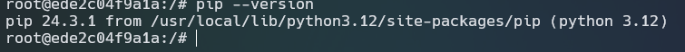

## Question 1: Understanding Docker First Run
Run the python:3.12.8 Docker image in interactive mode and check the pip version:

- answer: **24.3.1**

## Question 2: Understanding Docker Networking and Docker Compose
From the given docker-compose.yaml, the pgadmin service can connect to the postgres database using:

- Hostname: **db**
- Port: **5433**
- Answer: **db:5432**

## Question 3. Trip Segmentation Count
During the period of October 1st 2019 (inclusive) and November 1st 2019 (exclusive), how many trips, respectively, happened:

- Up to 1 mile
- In between 1 (exclusive) and 3 miles (inclusive),
- In between 3 (exclusive) and 7 miles (inclusive),
- In between 7 (exclusive) and 10 miles (inclusive),
- Over 10 miles

### Solution 
```sql
SELECT
    COUNT(CASE WHEN trip_distance <= 1 THEN 1 END) AS "Up to 1 mile",
    COUNT(CASE WHEN trip_distance > 1 AND trip_distance <= 3 THEN 1 END) AS "Between 1 and 3 miles",
    COUNT(CASE WHEN trip_distance > 3 AND trip_distance <= 7 THEN 1 END) AS "Between 3 and 7 miles",
    COUNT(CASE WHEN trip_distance > 7 AND trip_distance <= 10 THEN 1 END) AS "Between 7 and 10 miles",
    COUNT(CASE WHEN trip_distance > 10 THEN 1 END) AS "Over 10 miles"
FROM green_taxi_trips
WHERE lpep_pickup_datetime >= '2019-10-01'
  AND lpep_pickup_datetime < '2019-11-01';
/* {
  "Up to 1 mile": "104830",
  "Between 1 and 3 miles": "198995",
  "Between 3 and 7 miles": "109642",
  "Between 7 and 10 miles": "27686",
  "Over 10 miles": "35201"
}*/
```

## Question 4: Longest Trip for Each Day

```sql
SELECT
    DATE(lpep_pickup_datetime) AS pickup_date,
    MAX(trip_distance) AS longest_trip
FROM green_taxi_trips
GROUP BY pickup_date
ORDER BY longest_trip DESC
LIMIT 1;
/*
{
  "pickup_date": "2019-10-31",
  "longest_trip": 515.89
}
*/
```

## Question 5: Three Biggest Pickup Zones

```sql
SELECT
    zones."Zone" AS pickup_zone,
    SUM(total_amount) AS total_amount
FROM green_taxi_trips
JOIN taxi_zone_lookup AS zones
    ON green_tripdata.PULocationID = zones.LocationID
WHERE DATE(lpep_pickup_datetime) = '2019-10-18'
GROUP BY zones."Zone"
HAVING SUM(total_amount) > 13000
ORDER BY total_amount DESC;

/*
{
  "pickup_zone": "East Harlem North",
  "total_amount": 18686.68000000004
  
  "pickup_zone": "East Harlem South",
  "total_amount": 16797.260000000064

  "pickup_zone": "Morningside Heights",
  "total_amount": 13029.790000000037

}
*/
```

## Question 6: Largest Tip
```sql
SELECT
    zones."Zone" AS dropoff_zone,
    MAX(tip_amount) AS largest_tip
FROM green_taxi_trips
JOIN taxi_zones AS zones
    ON green_taxi_trips."DOLocationID" = zones."LocationID"
WHERE DATE(lpep_pickup_datetime) >= '2019-10-01'
  AND DATE(lpep_pickup_datetime) < '2019-11-01'
  AND green_taxi_trips."PULocationID" = (
      SELECT "LocationID" FROM taxi_zones WHERE "Zone" = 'East Harlem North'
  )
GROUP BY zones."Zone"
ORDER BY largest_tip DESC
LIMIT 1;

/*
{
  "dropoff_zone": "JFK Airport",
  "largest_tip": 87.3
}
*/
```

## Question 7: Terraform Workflow
Which of the following sequences, respectively, describes the workflow for:

1. Downloading the provider plugins and setting up backend,
2. Generating proposed changes and auto-executing the plan
3. Remove all resources managed by terraform`

**Answers:**
- Initialize Terraform: 
```cmd 
terraform init
```
- Generate Plan and Apply:
```cmd 
terraform apply -auto-approve
```
- Destroy Resources: 
```cmd 
terraform destroy
```
